### Hi, I'm Abdullah 👋

**Laravel & PHP Backend Developer** with 3+ years building production systems that scale.

I build backends that hold up under real use — clean architecture, well-structured
REST APIs, optimized databases, and secure authentication. I work mostly with SaaS,
e-commerce, and marketplace platforms.

---

### 🛠️ Tech Stack

- **Backend:** Laravel · PHP (OOP, MVC) · Eloquent ORM · REST APIs
- **Databases:** MySQL · MongoDB · Redis
- **Real-Time & Search:** WebSockets (Pusher / Laravel Echo) · Elasticsearch
- **Auth & Security:** Sanctum · JWT · OAuth2 · RBAC
- **DevOps:** Git · Docker · GitHub Actions · GitLab CI/CD
- **Integrations:** Stripe · PayPal · Twilio

---

#### 📌 What I focus on
- Scalable, modular backend architecture (SOLID, DRY, MVC)
- API design and third-party integrations
- Database performance — query optimization, indexing, schema design

---

### 📊 GitHub Stats

<!--
  Generated by the Metrics GitHub Action (.github/workflows/metrics.yml).
  This SVG is committed to the repo, so it never breaks like the public
  github-readme-stats endpoint does.
-->

---

#### 📫 Reach me
- LinkedIn: [abdullah-bin-shahid](https://linkedin.com/in/abdullah-bin-shahid)
- Email: abdullahbinshahid287@gmail.com
